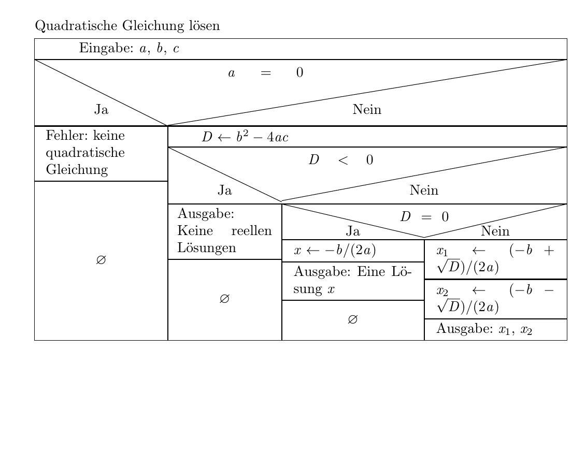

# Übung: Quadratische Gleichungen lösen

## Ziel

Entwickle ein Konsolenprogramm in C#, das quadratische Gleichungen der Form ax² + bx + c = 0 löst und die Lösungen berechnet.

## Beschreibung

Eine quadratische Gleichung ist eine Gleichung zweiten Grades der Form ax² + bx + c = 0, wobei a, b und c reelle Zahlen sind und a ≠ 0.

Die Lösungen einer quadratischen Gleichung werden mit der **Mitternachtsformel** (auch abc-Formel oder quadratische Formel genannt) berechnet:

```
x = (-b ± √(b² - 4ac)) / (2a)
```

Der Ausdruck unter der Wurzel (b² - 4ac) wird **Diskriminante** genannt und bestimmt, wie viele Lösungen die Gleichung hat:

- **Diskriminante > 0**: Zwei verschiedene reelle Lösungen
- **Diskriminante = 0**: Eine Lösung (Doppellösung)
- **Diskriminante < 0**: Keine reellen Lösungen (nur komplexe Lösungen, die in dieser Übung nicht behandelt werden)

## Struktogramm



## Anforderungen

1. **Eingabe der Koeffizienten**: Fordere den Benutzer auf, die Werte für a, b und c einzugeben.

2. **Validierung von a**: Überprüfe, ob a nicht gleich 0 ist. Wenn a = 0 ist, gib eine Fehlermeldung aus, da es sich dann nicht um eine quadratische Gleichung handelt.

3. **Berechnung der Diskriminante**: Berechne die Diskriminante: D = b² - 4ac

4. **Fallunterscheidung**:
   - Wenn D < 0: Gib aus, dass die Gleichung keine reellen Lösungen hat.
   - Wenn D = 0: Berechne und gib die eine Lösung aus: x = -b / (2a)
   - Wenn D > 0: Berechne und gib beide Lösungen aus:
     - x₁ = (-b + √D) / (2a)
     - x₂ = (-b - √D) / (2a)

5. **Verwendung von Math.Sqrt()**: Um die Quadratwurzel zu berechnen, verwende die Methode `Math.Sqrt()` aus der Math-Klasse.

## Der Datentyp `double`

Bisher hast du mit dem Datentyp `int` (Integer) gearbeitet, der nur ganze Zahlen speichern kann. Für die Berechnung von quadratischen Gleichungen benötigst du jedoch **Kommazahlen** (Dezimalzahlen), da die Lösungen oft keine ganzen Zahlen sind.

In C# gibt es dafür den Datentyp `double`:

```csharp
double pi = 3.14159;
double temperatur = 36.5;
double preis = 19.99;
```

**Wichtig**: In C# wird der **Punkt** als Dezimaltrennzeichen verwendet, nicht das Komma!

### Eingabe von double-Werten

Um eine Benutzereingabe in eine Kommazahl umzuwandeln, verwendest du `Convert.ToDouble()` statt `Convert.ToInt32()`:

```csharp
Console.Write("Gib eine Zahl ein: ");
string eingabe = Console.ReadLine();
double zahl = Convert.ToDouble(eingabe);
```

**Hinweis**: Bei der Eingabe akzeptiert `Convert.ToDouble()` das Dezimaltrennzeichen deines Betriebssystems (in Deutschland also das Komma: 3,14).

### Rechnen mit double

Mit `double` kannst du genauso rechnen wie mit `int`:

```csharp
double a = 10.5;
double b = 3.0;
double summe = a + b;      // 13.5
double differenz = a - b;   // 7.5
double produkt = a * b;     // 31.5
double quotient = a / b;    // 3.5
```

## Die Math-Klasse

C# bietet eine Math-Klasse mit vielen nützlichen mathematischen Funktionen. Für diese Übung benötigst du:

**Math.Sqrt(zahl)** - Berechnet die Quadratwurzel einer Zahl

Beispiel:
```csharp
double ergebnis = Math.Sqrt(16);  // ergebnis = 4.0
double wurzel = Math.Sqrt(2);     // wurzel = 1.41421...
```

**Math.Pow(basis, exponent)** - Berechnet Potenzen (optional für diese Übung)

Beispiel:
```csharp
double quadrat = Math.Pow(5, 2);  // quadrat = 25.0
```

**Wichtig**: Math.Sqrt() erwartet und liefert `double` Werte. Wenn du mit `int` arbeitest, musst du eventuell zwischen `int` und `double` konvertieren.

## Beispiel

```
Quadratische Gleichung lösen: ax² + bx + c = 0

Gib den Wert für a ein: 1
Gib den Wert für b ein: -5
Gib den Wert für c ein: 6

Gleichung: 1x² + -5x + 6 = 0

Diskriminante: 1
Die Gleichung hat zwei Lösungen:
x₁ = 3
x₂ = 2
```

```
Quadratische Gleichung lösen: ax² + bx + c = 0

Gib den Wert für a ein: 1
Gib den Wert für b ein: -4
Gib den Wert für c ein: 4

Gleichung: 1x² + -4x + 4 = 0

Diskriminante: 0
Die Gleichung hat eine Lösung:
x = 2
```

```
Quadratische Gleichung lösen: ax² + bx + c = 0

Gib den Wert für a ein: 1
Gib den Wert für b ein: 0
Gib den Wert für c ein: 4

Gleichung: 1x² + 0x + 4 = 0

Diskriminante: -16
Die Gleichung hat keine reellen Lösungen.
```

## Optional

- Gib die Gleichung in einer schönen, lesbaren Form aus (z.B. "2x² + 3x - 5 = 0")
- Formatiere die Lösungen auf 2 Dezimalstellen
- Erstelle eine Schleife, damit der Benutzer mehrere Gleichungen nacheinander lösen kann
- Teste dein Programm mit verschiedenen Werten:
  - x² - 5x + 6 = 0 (Lösungen: x₁=3, x₂=2)
  - x² - 4x + 4 = 0 (Lösung: x=2)
  - x² + 4 = 0 (keine reellen Lösungen)
  - 2x² - 8x + 6 = 0 (Lösungen: x₁=3, x₂=1)
