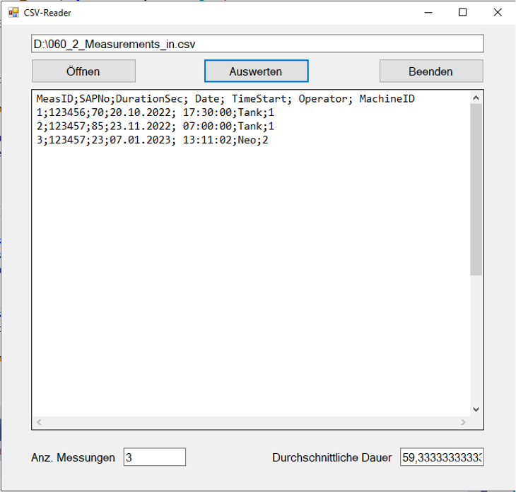

# CSV-Dateianalyse für Messdaten

## Einführung

In dieser Übung entwickeln Sie eine Windows Forms-Anwendung in C#, die CSV-Dateien mit Messdaten einlesen, anzeigen und auswerten kann. Die Anwendung soll die Anzahl der Messungen zählen und die durchschnittliche Messdauer berechnen. Diese Übung kombiniert Konzepte der Dateiverarbeitung, Datenanalyse und GUI-Programmierung.

## Lernziele

Nach Abschluss dieser Übung sollten Sie in der Lage sein:

- CSV-Dateien in C# einzulesen und zu verarbeiten
- Daten in geeigneten Objektstrukturen zu speichern
- Einfache statistische Berechnungen durchzuführen
- Eine funktionale Windows Forms-Benutzeroberfläche zu erstellen
- Fehlerbehandlung in Dateioperationen zu implementieren

## Aufgabenbeschreibung

### Benutzeroberfläche

Erstellen Sie eine Windows Forms-Anwendung mit folgender Benutzeroberfläche:



- Eine Textbox zur Anzeige des Dateipfads (tbxFilepath)
- Drei Buttons:
  - "Öffnen" (btnOpen): Zum Auswählen und Einlesen einer CSV-Datei
  - "Auswerten" (btnAnalyze): Zur Analyse der eingelesenen Daten
  - "Beenden" (btnExit): Zum Schließen der Anwendung
- Eine große Textbox zur Anzeige des Dateiinhalts (tbxContent)
- Zwei Textboxen zur Anzeige der Auswertungsergebnisse:
  - Anzahl der Messungen (tbxMeasurements)
  - Durchschnittliche Messdauer (tbxAverageDuration)

### Funktionalität

#### Öffnen-Button (btnOpen_Click)

1. Öffnet einen Dateiauswahldialog (openFileDialog1)
2. Liest bei erfolgreicher Auswahl die CSV-Datei ein
3. Zeigt den Dateipfad in tbxFilepath an
4. Überspringt die Kopfzeile der CSV-Datei
5. Erstellt für jede Datenzeile ein Measurement-Objekt und fügt es einer Liste hinzu
6. Zeigt den Inhalt der Liste in tbxContent an

#### Auswerten-Button (btnAnalyze_Click)

1. Überprüft, ob die Datei eine gültige CSV-Datei ist (endet mit ".csv")
2. Falls nicht, färbt die Textbox tbxFilepath rot und löscht die berechneten Werte
3. Andernfalls:
   a. Zählt die Anzahl der gültigen Messungen
   b. Berechnet die durchschnittliche Messdauer (DurationSec)
   c. Zeigt diese Werte in den entsprechenden Textboxen an
   d. Extrahiert und zeigt nur die MeasID und DurationSec-Werte in tbxContent an

#### Beenden-Button (btnExit_Click)

1. Schließt die Anwendung mit Application.Exit()

## Datenmodell

### Measurement-Klasse

Die Measurement-Klasse repräsentiert eine einzelne Messung aus der CSV-Datei. Sie enthält alle relevanten Daten und Methoden zur Verarbeitung dieser Daten.

```
+----------------------------------+
|           Measurement            |
+----------------------------------+
| - measId : int                   |
| - SAPNo : int                    |
| - durationSec : int              |
| - date : string                  |
| - timeStart : string             |
| - op : string                    |
| - machineId : int                |
| - startHour : int                |
| - startMinute : int              |
| - startSecond : int              |
+----------------------------------+
| + Measurement(csv : string)      |
| + Measurement(measId : int,      |
|   SAPNo : int, durationSec : int,|
|   date : string, timeStart : string,|
|   op : string, machineId : int)  |
| + ToString() : string            |
| + ToCSV() : string               |
| - ParseTimeStart() : void        |
| + GetTimeEnd() : string          |
| + ToCsvStartEnd() : string       |
| + GetDurationSec() : int         |
+----------------------------------+
```

#### Attribute

- **measId**: Eindeutige Identifikationsnummer der Messung
- **SAPNo**: SAP-Nummer des gemessenen Produkts
- **durationSec**: Dauer der Messung in Sekunden
- **date**: Datum der Messung im Format YYYY-MM-DD
- **timeStart**: Startzeit der Messung im Format HH:MM:SS
- **op**: Bezeichnung des Vorgangs/der Operation
- **machineId**: Identifikationsnummer der verwendeten Maschine
- **startHour, startMinute, startSecond**: Zerlegte Komponenten der Startzeit für Berechnungen

#### Konstruktoren

- **Measurement(csv: string)**

  - Erstellt ein Measurement-Objekt aus einer CSV-Zeile
  - Zerlegt die durch Semikolon getrennte Zeichenkette in ihre Bestandteile
  - Konvertiert die Werte in die entsprechenden Datentypen
  - Speichert die Werte in den Attributen des Objekts

- **Measurement(measId, SAPNo, durationSec, date, timeStart, op, machineId)**
  - Erstellt ein Measurement-Objekt mit explizit angegebenen Werten
  - Ermöglicht die manuelle Erstellung von Measurement-Objekten im Code

#### Methoden

- **ToString(): string**

  - Überschreibt die Standard-ToString()-Methode
  - Gibt eine formatierte Zeichenkette mit der Mess-ID und der Dauer zurück
  - Format: "{measId}: {durationSec}"
  - Wird für die Anzeige in der Textbox verwendet

- **ToCSV(): string**

  - Konvertiert das Measurement-Objekt zurück in eine CSV-Zeile
  - Verbindet alle Attribute mit Semikolons
  - Nützlich für das Speichern von Daten zurück in eine CSV-Datei

- **ParseTimeStart(): void** (private)

  - Zerlegt die timeStart-Zeichenkette in Stunden, Minuten und Sekunden
  - Speichert diese Werte in den entsprechenden Attributen
  - Wird intern von GetTimeEnd() verwendet

- **GetTimeEnd(): string**

  - Berechnet die Endzeit der Messung basierend auf der Startzeit und der Dauer
  - Ruft ParseTimeStart() auf, um die Startzeit zu zerlegen
  - Addiert die Dauer in Sekunden zur Startzeit
  - Berücksichtigt Überläufe bei Sekunden, Minuten und Stunden
  - Gibt die Endzeit im Format HH:MM:SS zurück

- **ToCsvStartEnd(): string**

  - Erstellt eine CSV-Zeile mit Mess-ID, Startzeit und Endzeit
  - Format: "{measId};{timeStart};{GetTimeEnd()}"
  - Nützlich für spezielle Auswertungen, die nur Start- und Endzeit benötigen

- **GetDurationSec(): int**
  - Gibt den Wert des durationSec-Attributs zurück
  - Wird für die Berechnung der durchschnittlichen Messdauer verwendet
  - Ermöglicht den Zugriff auf die private Variable durationSec von außerhalb der Klasse

### Form1-Klasse

Die Form1-Klasse implementiert die Benutzeroberfläche und die Logik zur Verarbeitung der CSV-Dateien.

```
+----------------------------------+
|              Form1               |
+----------------------------------+
| - tbxFilepath : TextBox          |
| - btnOpen : Button               |
| - btnAnalyze : Button            |
| - btnExit : Button               |
| - tbxContent : TextBox           |
| - tbxMeasurements : TextBox      |
| - tbxAverageDuration : TextBox   |
| - openFileDialog1 : OpenFileDialog|
| - measurements : List<Measurement>|
+----------------------------------+
| + Form1()                        |
| - btnOpen_Click(sender : object, |
|   e : EventArgs) : void          |
| - btnAnalyze_Click(sender : object,|
|   e : EventArgs) : void          |
| - btnExit_Click(sender : object, |
|   e : EventArgs) : void          |
| - ReadCSVFile(filePath : string) :|
|   List<Measurement>              |
| - CalculateAverageDuration() :   |
|   double                         |
| - IsCSVFile(filePath : string) : |
|   bool                           |
| - DisplayMeasurements() : void   |
+----------------------------------+
```

### Beziehung zwischen den Klassen

Die Form1-Klasse verwendet eine Liste von Measurement-Objekten zur Speicherung und Verarbeitung der eingelesenen Daten. Es handelt sich um eine unidirektionale Assoziation, da die Form1-Klasse die Measurement-Klasse kennt, aber nicht umgekehrt.

#### Attribute

- **tbxFilepath**: Textbox zur Anzeige des Dateipfads
- **btnOpen**: Button zum Öffnen einer CSV-Datei
- **btnAnalyze**: Button zum Auswerten der Daten
- **btnExit**: Button zum Beenden der Anwendung
- **tbxContent**: Textbox zur Anzeige des Dateiinhalts
- **tbxMeasurements**: Textbox zur Anzeige der Anzahl der Messungen
- **tbxAverageDuration**: Textbox zur Anzeige der durchschnittlichen Messdauer
- **openFileDialog1**: Dialog zum Auswählen einer Datei
- **measurements**: Liste von Measurement-Objekten

#### Methoden

- **Form1()**

  - Konstruktor der Form1-Klasse
  - Initialisiert die Komponenten der Benutzeroberfläche

- **btnOpen_Click(sender, e)**

  - Ereignishandler für den Öffnen-Button
  - Öffnet einen Dateiauswahldialog
  - Liest die ausgewählte CSV-Datei ein
  - Erstellt Measurement-Objekte und speichert sie in der Liste
  - Zeigt den Inhalt in der Textbox an

- **btnAnalyze_Click(sender, e)**

  - Ereignishandler für den Auswerten-Button
  - Überprüft, ob die Datei eine gültige CSV-Datei ist
  - Berechnet die Anzahl der Messungen und die durchschnittliche Messdauer
  - Zeigt die Ergebnisse in den entsprechenden Textboxen an

- **btnExit_Click(sender, e)**

  - Ereignishandler für den Beenden-Button
  - Schließt die Anwendung

- **ReadCSVFile(filePath)**

  - Liest eine CSV-Datei ein und erstellt Measurement-Objekte
  - Überspringt die Kopfzeile der CSV-Datei
  - Gibt eine Liste von Measurement-Objekten zurück

- **CalculateAverageDuration()**

  - Berechnet die durchschnittliche Messdauer aller Measurement-Objekte
  - Verwendet die GetDurationSec()-Methode der Measurement-Klasse
  - Gibt den Durchschnittswert als double zurück

- **IsCSVFile(filePath)**

  - Überprüft, ob der angegebene Dateipfad auf eine CSV-Datei verweist
  - Prüft, ob der Dateipfad mit ".csv" endet
  - Gibt einen booleschen Wert zurück

- **DisplayMeasurements()**
  - Zeigt die Measurement-Objekte in der tbxContent-Textbox an
  - Formatiert die Ausgabe gemäß den Anforderungen

## Implementierungshinweise

### CSV-Dateiformat

Die zu verarbeitenden CSV-Dateien haben folgendes Format:

- Die erste Zeile enthält Spaltenüberschriften
- Die Daten sind durch Semikolon (;) getrennt
- Jede Zeile repräsentiert eine Messung

```
MeasID;SAPNo;DurationSec;Date;TimeStart;OP;MachineID
1;12345;120;2023-01-01;10:15:00;Test;1
2;12346;180;2023-01-01;11:30:00;Test;2
```

### Fehlerbehandlung

Implementieren Sie folgende Fehlerbehandlungen:

- Überprüfen Sie, ob die ausgewählte Datei mit ".csv" endet
- Färben Sie die Textbox mit dem Dateipfad rot, wenn es keine CSV-Datei ist
- Löschen Sie in diesem Fall die berechneten Werte
- Fangen Sie Ausnahmen bei der Dateiverarbeitung ab und zeigen Sie entsprechende Fehlermeldungen an

### Formatierung der Ausgabe

- Formatieren Sie die durchschnittliche Messdauer mit zwei Dezimalstellen
- Verwenden Sie für die Anzeige in tbxAverageDuration das Format "{0:0.00}"

## Bewertungskriterien

Ihre Lösung wird nach folgenden Kriterien bewertet:

- Korrekte Implementierung der geforderten Funktionalität
- Saubere Strukturierung des Codes
- Angemessene Fehlerbehandlung
- Korrekte Berechnung der statistischen Werte
- Benutzerfreundliche Gestaltung der Benutzeroberfläche
